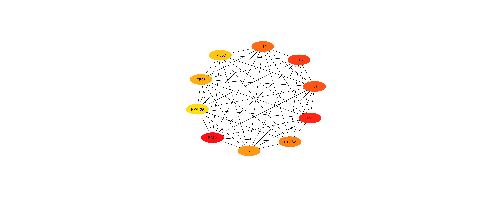
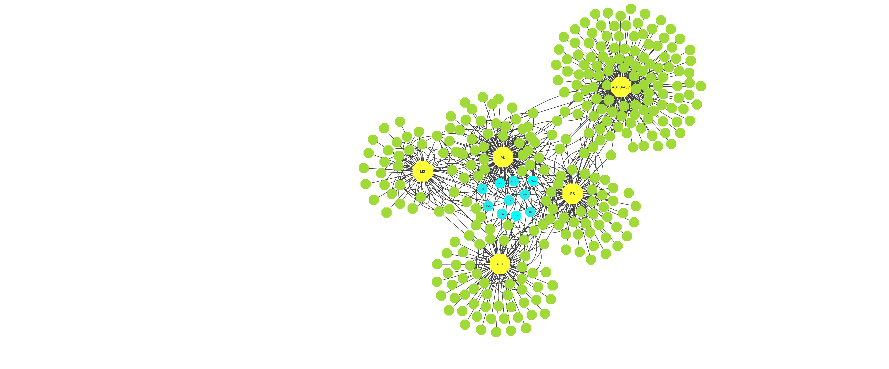
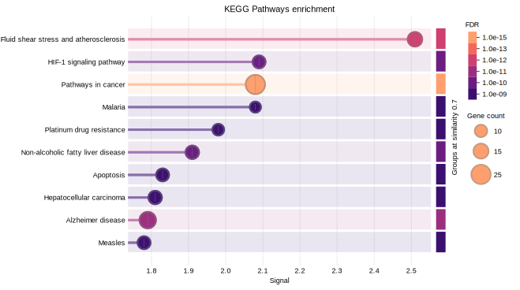
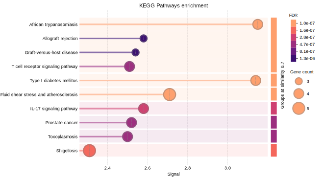

# Computational Network-Based Identification of Heavy Metal–Associated Hub Genes and Pathways in Neurodegenerative Disorders

---

## 🔍 Overview

This repository provides **data, network files, and visual results** from a computational toxicogenomics study investigating how **heavy metal exposure** contributes to **neurodegenerative and neurodevelopmental disorders** through **shared molecular interaction networks**.

The analysis integrates **chemical–gene–disease associations** with **protein–protein interaction (PPI) networks** to identify **central hub genes** and **conserved biological pathways** implicated in heavy metal–induced neurotoxicity.

---

## 🧠 Neurological Conditions Analyzed

- Alzheimer’s disease (AD)  
- Parkinson’s disease (PD)  
- Amyotrophic Lateral Sclerosis (ALS)  
- Multiple Sclerosis (MS)  
- Autism Spectrum Disorder / ADHD  

---

## ⚙️ Heavy Metals Included

- Lead (Pb)  
- Mercury (Hg)  
- Cadmium (Cd)  
- Chromium (Cr)  
- Arsenic (As)  
- Zinc (Zn)  

---

## 🧬 Analysis Workflow (Conceptual Overview)

---

## 🌐 Global Protein–Protein Interaction Network

The global PPI network reveals dense molecular connectivity among genes shared between heavy metal exposure and neurological disorders, indicating coordinated regulatory interactions.

---

## ⭐ Hub Gene Identification

Hub genes were prioritized using **Maximal Clique Centrality (MCC)**, revealing a tightly connected regulatory core within the network.

**Top 10 hub genes identified:**

TP53, TNF, IL1B, IL10, INS,  
BCL2, IFNG, PTGS2, PPARG, HMOX1

### STRING-Based Hub Gene Network

### MCC Top 10 Hub Gene Ranking

---

## 🧩 Disease–Gene Interaction Network

The disease–gene interaction network highlights shared hub gene associations across multiple neurological disorders, supporting a common molecular framework underlying heavy metal–induced neurotoxicity.

---

## 📊 Functional Enrichment Analysis

GO and KEGG enrichment analyses demonstrate significant overrepresentation of biological pathways related to neuronal damage and disease progression.

### KEGG Pathway Enrichment (Common Genes)

### KEGG Pathway Enrichment (Hub Genes)

**Major enriched biological processes include:**
- Immune and inflammatory signaling  
- Oxidative stress response  
- Apoptosis and mitochondrial dysfunction  
- Protein homeostasis and synaptic regulation  

These findings indicate conserved molecular mechanisms linking heavy metal exposure to diverse neurological disorders.

---

## 📁 Repository Structure

---

## 👁️ How to Use This Repository

- Browse **`Git_Hub/Results_img`** for final visual summaries  
- Open **`Git_Hub/Cytoscaoe_visual` files in Cytoscape** for interactive network exploration  
- Use **Git_Hub/String_data** for downstream analysis or validation  
- Reference identified hub genes and pathways for hypothesis generation  

---

## 📌 Scope & Status

- Repository contains **data, figures, and network files only**

---

## 📫 Contact

**Author:** Kritika Sharma  
**Email:** kritika7475@gmail.com
